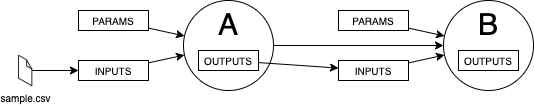

# DAGGR - Directed Acyclic Graph Generator & Runtime


**This is a toy project.**

DAGGR is designed to define and execute workflows that can be represented as Directed Acyclic Graphs (DAGs) using a declarative approach, using YAML files for example.

<hr>

## DAG Steps
Each DAG is composed of series of steps. These steps can have inputs, outputs, parameters and dependencies.

### Step Input
There is currently one kind input sources: `step`. These are inputs loaded from a previous step's output. 

**TODO**: create an input source `static`, loaded from files stored in the file system.

### Step Output
A step output is always the returned value from a step function's with the `@output` decorator, provided by the DAGGR library.

* **TODO**: support multiple outputs per step.

### Dependencies



An explicit dependency can be configured in the workflow definition by specifying the step name. See [below](#workflow-definition) for more details.

* **TODO**: allow implicit dependency configuration, inferred from inputs coming from step's outputs.    
    The implicit dependency is set by simply having Step `B` with inputs that depend on the outputs of Step `A`.

## Workflow Definition
A workflow definition can be declared via a YAML file with the following fields:
* `dag`: name of the DAG
* `steps`: key-value pairs, where the key represents the step's name and the value has the step's configuration
  * `script`: path of the script to be executed. If omitted, the name of the step followed by `.py` will be used
  * `parameters`: key-value pairs passed to the step as parameters
  * `inputs`: key-value pairs containing input names and source
  * `depends_on`: list of steps that must be executed before this step

Simple workflow definition example:
```yaml
dag: my_dag

steps:
  step1: 
    script: my/script/location

  step2:
    inputs:
      data: output:step1
    parameters:
      answer: 42
    depends_on: 
      - step1
```

## Step Definition
Any python script can be used in the steps, but to be able to use inputs, output, and parameters, one must use the decorators `@inputs`, and `@output` provided by the DAGGR library.

Example:
```python
from daggr.core.decorators import inputs, output

@inputs()
@output("approved", type="pickle")
def filter(inputs: Dict[str, Any] = None, parameters: Dict[str, Any] = None):
    approved = {}
    data = inputs['input_name']
    param = parameters['parameter_name']
    # ...
    return approved
```

## Workflow execution
To execute a workflow, use the `run` command provided by the DAGGR CLI, passing the workflow definition file as an argument.

```sh
daggr run -w workflows/examples/simple_workflow_example/workflow.yml
```

## Dependencies
```
yamale==4.0.2
click==8.0.3
```

`yamale` is used to validate the YAML workflow definition file's schema.

`click` is used to simplify the creation of a powerful, feature-rich CLI.

## Development Dependencies
```
black==21.12b0
autoflake==1.4
pytest==6.2.5
isort==5.10.1
pytest-cov==3.0.0
pytest-watch
```

`black`, `autoflake`, and `isort` set the code style and linting rules.


`pytest`, `pytest-cov`, `pytest-watch` are used for testing, coverage and TDD, respectively.


